<p align="center">
  <picture>
    <source media="(prefers-color-scheme: dark)" srcset="assets/banner-dark.gif">
    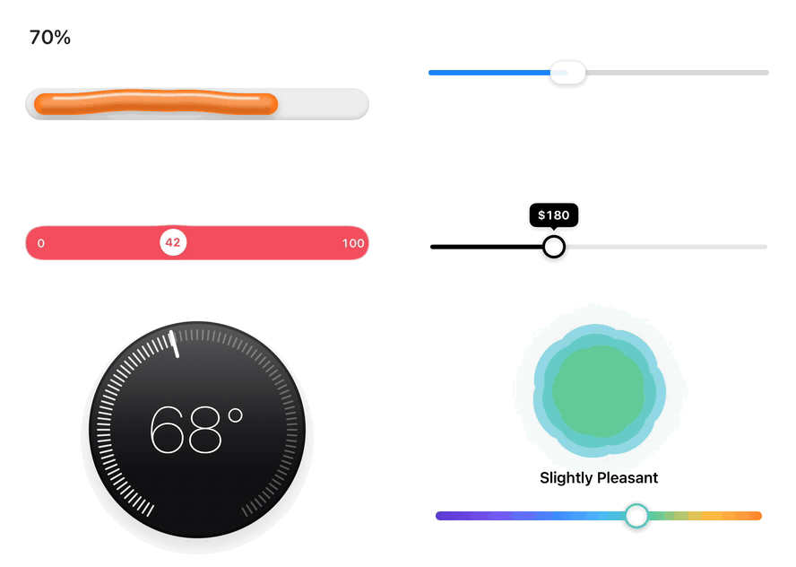
  </picture>
</p>

<h1 align="center">Scrubbers</h1>

<p align="center">
  Twelve sliders you'll want to touch, for SwiftUI.<br />
  One view, one enum, one line to drop in.
</p>

<p align="center">
  
  
  
  
  
</p>

---

```swift
Scrubber(.jelly, value: $value)
```

That is the whole integration. Swap `.jelly` for any of the twelve styles below. Each one is its own control with its own feel under the finger, not a skin on one slider: jelly that buckles when you push it, a pill that turns into a lens, a bead that pops out on a gooey neck, a thermostat you turn round its ring. They all take the same value, range and step, tick a light haptic at each detent, read to VoiceOver as a standard slider, and follow your `.tint`.

It started as the ruler under [iOS Eras](https://github.com/haplollc/ios-eras), pulled out into its own component. The other eleven recreate some of the best-loved sliders from Apple, Google, Nest, Instagram and the design community.

**[Watch the 35-second demo, with sound (MP4)](assets/demo.mp4)**

## Installation

In Xcode: **File > Add Package Dependencies** and paste

```
https://github.com/haplollc/Scrubbers
```

Or in `Package.swift`:

```swift
dependencies: [
    .package(url: "https://github.com/haplollc/Scrubbers", from: "1.0.0")
]
```

Then add `Scrubbers` to your target's dependencies.

## Quick start

```swift
import SwiftUI
import Scrubbers

struct VolumeRow: View {
    @State private var volume = 0.6

    var body: some View {
        Scrubber(.elastic, value: $volume)
            .scrubberIcons(low: "speaker.fill", high: "speaker.wave.3.fill")
    }
}
```

## The styles

Every style is a case of `ScrubberStyle`. Pass it as the first argument.

<!-- STYLES:START -->
| | Style | In code | After |
|:---:|---|---|---|
| <picture><source media="(prefers-color-scheme: dark)" srcset="assets/styles/ruler-dark.gif">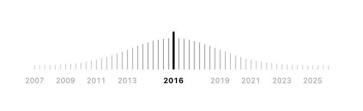</picture> | **Ruler**<br><sub>Ticks swell into a bell around the indicator</sub> | `.ruler` | [iOS Eras](https://github.com/haplollc/ios-eras), after [@colderoshay](https://x.com/colderoshay)'s “life of a button” |
| <picture><source media="(prefers-color-scheme: dark)" srcset="assets/styles/glass-dark.gif">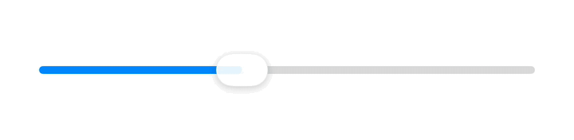</picture> | **Glass**<br><sub>The thumb turns into a lens while held</sub> | `.glass` | Apple's [Liquid Glass sliders](https://developer.apple.com/videos/play/wwdc2025/323/), iOS 26 |
| <picture><source media="(prefers-color-scheme: dark)" srcset="assets/styles/jelly-dark.gif">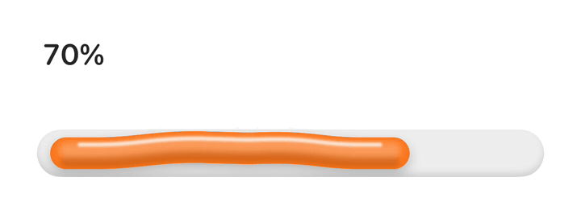</picture> | **Jelly**<br><sub>Buckles into a wobbling hump when you push it</sub> | `.jelly` | Voicu Apostol's [Jelly Slider](https://dribbble.com/shots/26498172-Jelly-Slider) and Software Mansion's [real-time port](https://swmansion.com/blog/breaking-down-the-jelly-slider-9ab9239f6d80/) |
| <picture><source media="(prefers-color-scheme: dark)" srcset="assets/styles/elastic-dark.gif">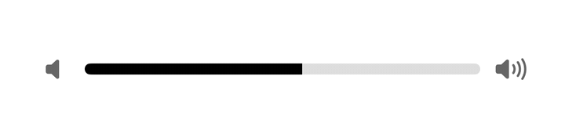</picture> | **Elastic**<br><sub>Stretches past its ends and snaps back</sub> | `.elastic` | Apple's volume sliders and BuildUI's [Elastic Slider](https://buildui.com/recipes/elastic-slider) |
| <picture><source media="(prefers-color-scheme: dark)" srcset="assets/styles/fluid-dark.gif">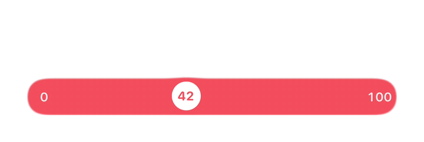</picture> | **Fluid**<br><sub>The value pops out on a gooey neck</sub> | `.fluid` | Virgil Pana's [Fluid Slider](https://dribbble.com/shots/3868232-ios-Fluid-Slider-ui-ux), open-sourced by [Ramotion](https://github.com/Ramotion/fluid-slider) |
| <picture><source media="(prefers-color-scheme: dark)" srcset="assets/styles/squiggle-dark.gif">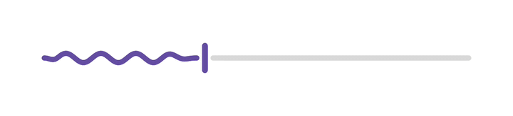</picture> | **Squiggle**<br><sub>A wave that flattens while you hold it</sub> | `.squiggle` | Android 13's [squiggly seek bar](https://www.androidpolice.com/android-13-squiggly-media-playback-bar/) and Material 3 Expressive |
| <picture><source media="(prefers-color-scheme: dark)" srcset="assets/styles/thermostat-dark.gif">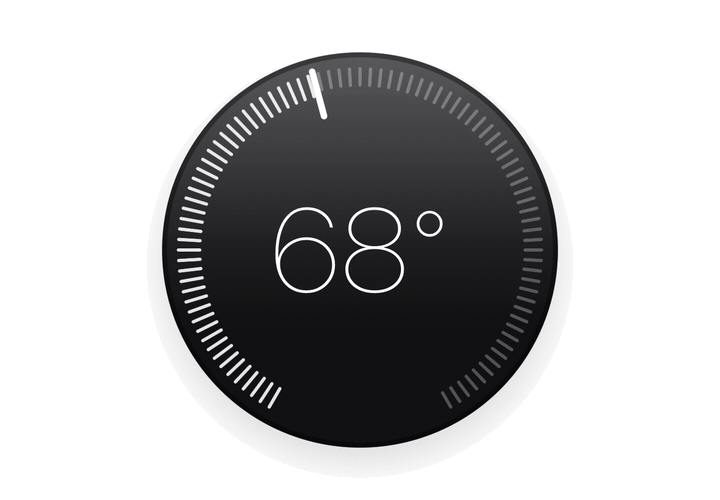</picture> | **Thermostat**<br><sub>A dial that floods warm or cool as you turn it</sub> | `.thermostat` | The [Nest Learning Thermostat](https://support.google.com/googlenest/answer/9243193?hl=en) |
| <picture><source media="(prefers-color-scheme: dark)" srcset="assets/styles/swing-dark.gif">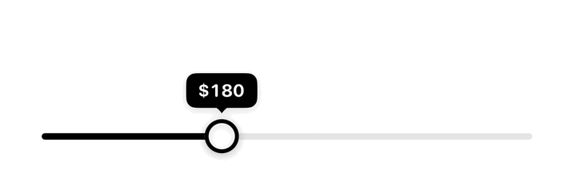</picture> | **Swing**<br><sub>A value tag that leans and swings with weight</sub> | `.swing` | The keyframers' [Diamond Slider](https://freefrontend.com/code/tilting-diamond-range-slider-effect-2026-03-30/) and Temani Afif's [jiggly tooltip](https://www.bram.us/2024/06/06/css-only-custom-range-slider-with-motion/) |
| <picture><source media="(prefers-color-scheme: dark)" srcset="assets/styles/mood-dark.gif">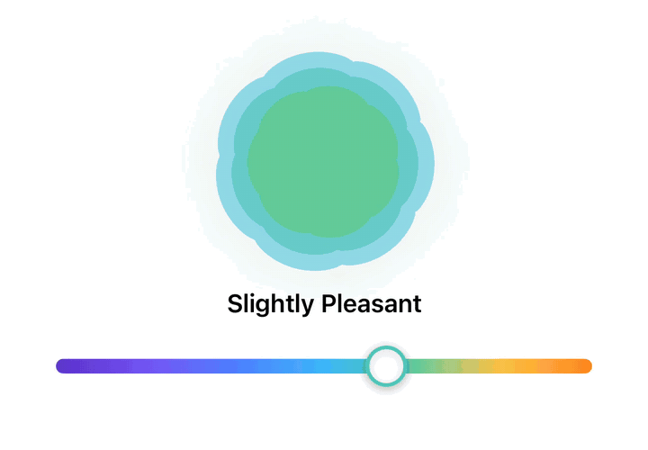</picture> | **Mood**<br><sub>Drag a feeling from spiky to round to blooming</sub> | `.mood` | Apple's [State of Mind](https://www.apple.com/newsroom/2023/06/apple-provides-powerful-insights-into-new-areas-of-health/) logging in Health |
| <picture><source media="(prefers-color-scheme: dark)" srcset="assets/styles/tape-dark.gif">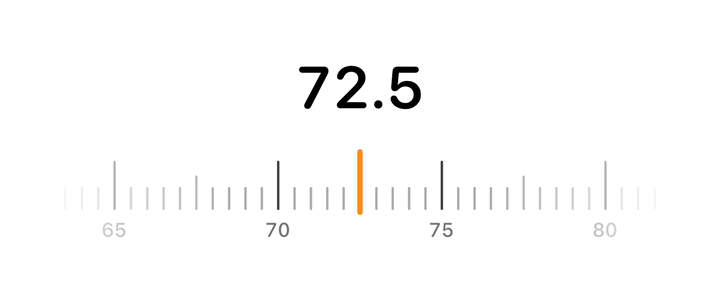</picture> | **Tape**<br><sub>A scale that coasts under a fixed needle</sub> | `.tape` | Health-app weight pickers, the Photos adjustment ruler and [SlidingRuler](https://github.com/Pyroh/SlidingRuler) |
| <picture><source media="(prefers-color-scheme: dark)" srcset="assets/styles/effort-dark.gif">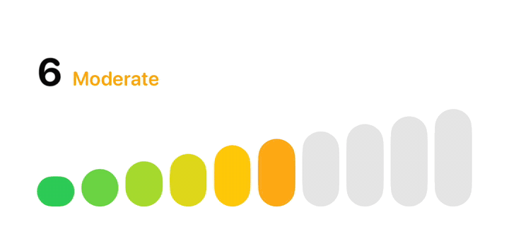</picture> | **Effort**<br><sub>Stepped bars that hop as you climb</sub> | `.effort` | The [effort rating](https://60fps.design/shots/apple-fitness-watch-effort-slider) in Apple's Fitness app |
| <picture><source media="(prefers-color-scheme: dark)" srcset="assets/styles/emoji-dark.gif">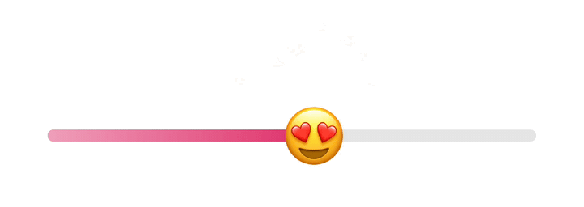</picture> | **Emoji**<br><sub>An emoji thumb that grows with the value</sub> | `.emoji` | Instagram's [emoji slider sticker](https://about.instagram.com/blog/announcements/introducing-the-emoji-slider-sticker) |
<!-- STYLES:END -->

```swift
ForEach(ScrubberStyle.allCases) { style in      // all twelve, with names
    Scrubber(style, value: $value)
}
```

## Values, ranges and steps

The same three arguments as SwiftUI's `Slider`, for every style:

```swift
Scrubber(.glass, value: $brightness)                                  // 0...1, continuous
Scrubber(.tape, value: $weight, in: 40...120, step: 0.5)              // a detent every half kilo
Scrubber(.thermostat, value: $temperature, in: 50...90, step: 1)      // a click a degree
Scrubber(.effort, value: $effort, in: 1...10)                         // Int: whole steps
```

`value` can be any `BinaryFloatingPoint` (`Double`, `CGFloat`, `Float`) or any `BinaryInteger`.

A stepped scrubber still moves smoothly under your finger and settles on its detent when you let go. By default the bound value is always on a step, like `Slider(step:)`. If whatever the scrubber drives can morph between steps, ask for the in-between values while dragging instead. This is how the iOS Eras ruler lets the phone redraw itself between two years:

```swift
Scrubber(.ruler, value: $position, in: 0...Double(years.count - 1), step: 1)
    .scrubberSnapping(.onRelease)   // fractions while dragging, a whole year on release
    .scrubberLabels { Text(String(years[Int($0.rounded())])) }
```

## Labels

One closure labels the ticks, the readouts and what VoiceOver says:

```swift
Scrubber(.ruler, value: $year, in: 2007...2026, step: 1)
    .scrubberLabels { Text(String(Int($0))) }

Scrubber(.thermostat, value: $temperature, in: 50...90, step: 1)
    .scrubberLabels { Text("\(Int($0))°") }

Scrubber(.fluid, value: $tip, in: 0...0.3, step: 0.01)
    .scrubberLabels(format: .percent.precision(.fractionLength(0)))
```

Without one, whole numbers show plainly and a continuous `0...1` value shows as a percentage. The mood style names the feeling instead, from *Very Unpleasant* to *Very Pleasant* (in English; pass your own labels to localize them).

## Colour and ink

```swift
Scrubber(.jelly, value: $value)
    .tint(.orange)                  // fills, thumbs, needles, the jelly itself

Scrubber(.ruler, value: $value)
    .foregroundStyle(.indigo)       // the ruler's ink, the tape's ticks, tracks

Scrubber(.emoji, value: $level)
    .scrubberEmoji("🔥")            // the emoji thumb (heart eyes by default)
```

Everything follows light and dark mode. Three styles carry the palette of the design they recreate rather than your tint: the thermostat's Nest blue and orange, mood's State of Mind colours, and effort's green-to-red.

## Motion, haptics and editing

```swift
Scrubber(.squiggle, value: $position, in: 0...duration)
    .scrubberAnimating(player.isPlaying)   // the wave rolls while playing, lies flat when paused

Scrubber(.glass, value: $value) { editing in
    isScrubbing = editing                  // true when a finger comes down, false when it lifts
}
.scrubberHaptics(false)                    // no ticks or knocks
```

- **Haptics.** A light selection tick as the value crosses each detent (on continuous rulers and tapes, at each mark), and a firmer knock when a continuous style hits an end. The ticks land on the frames where the marks actually pass, including while a released tape coasts.
- **Idle motion.** Only the squiggle's wave and the mood shape's slow turn move on their own, and both stop while scrolled out of view, while the app is in the background, and when you set `.scrubberAnimating(false)`.
- **Reduce Motion.** Releases settle with a short ease instead of a spring, the tape doesn't coast, the jelly lies flat, and nothing moves on its own.

## Accessibility

- To VoiceOver every style is a standard slider: swipe up or down to step one detent (or a tenth of a continuous range). It reads the same text the control shows. Give it a name as usual: `.accessibilityLabel("Volume")`.
- Disabled scrubbers (`.disabled(true)`) dim and ignore touches.
- Right-to-left layouts aren't mirrored yet: every style runs low to high, left to right.

## Recipes

**A seek bar that waves while music plays:**

```swift
Scrubber(.squiggle, value: $position, in: 0...214)
    .scrubberAnimating(isPlaying)
    .scrubberLabels { Text(Duration.seconds($0).formatted(.time(pattern: .minuteSecond))) }
```

**A volume row:**

```swift
Scrubber(.elastic, value: $volume)
    .scrubberIcons(low: "speaker.fill", high: "speaker.wave.3.fill")
    .accessibilityLabel("Volume")
```

**A workout rating in a form:**

```swift
Form {
    Section("How hard was it?") {
        Scrubber(.effort, value: $effort, in: 1...10)
    }
}
```

**A timeline that morphs as you scrub:** see the eras snippet under [Values, ranges and steps](#values-ranges-and-steps).

## How it's made

- **One view owns the touch.** `Scrubber` turns a finger into a position (by where it is, by how far it has travelled, or by the angle it has turned round a dial), rubber-bands it past the ends with Apple's scroll-view curve, measures its speed, lets a flicked tape coast, and snaps to a detent. Each style is only a face over that.
- **Faces are animatable.** Position, grip, stretch and speed travel as one animatable vector, so every face is redrawn on every frame of a settle, a coast or a swing, and the haptic ticks fire on the frames the marks actually pass.
- **Physics where it earns it.** The jelly is Software Mansion's Verlet chain (17 points, 6 substeps, 16 constraint passes, an arch force that grows with compression), with its length relaxing toward the handle so at rest it lies flat. The swing tag leans with the thumb's smoothed speed and swings back upright on an underdamped spring when the thumb stops. The fluid neck is real metaball goo: blur, then an alpha threshold, used as a mask over your tint.
- **Real Liquid Glass.** On iOS 26 the glass lens is Apple's own `glassEffect`, refracting the track at its rim over a magnified copy of the track. Before iOS 26 it is drawn.
- **Canvas, not a view per tick.** Rulers, tapes, dials and waves each draw in one `Canvas`.

## Tested on iPhone

- `Demo/ScrubbersDemo.xcodeproj` has UI tests that launch the demo app on an iPhone simulator, drag every style with a real touch in both directions, including the thermostat round its ring, and check the value each control reports to VoiceOver and the readout beside it. Every style is also checked to read as a slider, with the right words.
- The package's own tests cover the value math (fractions, detents, uneven steps, the rubber band), and compile and render every snippet in this README against the public API, in light and dark.
- Both suites pass on iPhone simulators running iOS 26.5 (iPhone 17 Pro and 17 Pro Max) and iOS 18.5 (iPhone 16 Pro).

```bash
xcodebuild test -scheme Scrubbers -destination "platform=iOS Simulator,name=iPhone 17 Pro"
xcodebuild test -project Demo/ScrubbersDemo.xcodeproj -scheme ScrubbersDemo \
  -destination "platform=iOS Simulator,name=iPhone 17 Pro"
```

## Development

Open `Demo/ScrubbersDemo.xcodeproj` to play with every style in a gallery. The media in this README is recorded from the same app on an iPhone simulator:

```bash
Scripts/render-media.sh            # every style's GIF, light and dark
Scripts/banner.py                  # the banner, from those recordings
Scripts/record-demo.sh             # the demo video, with a click on every haptic tick
Scripts/readme_tables.py           # the style table and credits, from one list
```

On a busy machine, prefix the recording scripts with `PACE=3` (or more): everything plays that many times slower (springs, glides, clocks, physics) and is sped back up afterwards, so no frame is dropped.

## Scripted demos

The demo video and the GIFs above are driven by a scripted finger that plays through exactly the same code path as a real touch, so every grab, stretch and swing happens as it would under a thumb. It is available for your own onboarding and demos, as SPI while its shape settles:

```swift
@_spi(Demo) import Scrubbers

let finger = ScrubberPuppet()

Scrubber(.elastic, value: $volume)
    .scrubberPuppet(finger)

// later
await finger.scrub(from: 0.2, to: 0.9, over: 1.2)
```

## Credits

The ruler is from [iOS Eras](https://github.com/haplollc/ios-eras). The others recreate these designs, all credit to their authors:

<!-- CREDITS:START -->
- **Glass** (`.glass`): Apple's [Liquid Glass sliders](https://developer.apple.com/videos/play/wwdc2025/323/), iOS 26.
- **Jelly** (`.jelly`): Voicu Apostol's [Jelly Slider](https://dribbble.com/shots/26498172-Jelly-Slider) and Software Mansion's [real-time port](https://swmansion.com/blog/breaking-down-the-jelly-slider-9ab9239f6d80/).
- **Elastic** (`.elastic`): Apple's volume sliders and BuildUI's [Elastic Slider](https://buildui.com/recipes/elastic-slider).
- **Fluid** (`.fluid`): Virgil Pana's [Fluid Slider](https://dribbble.com/shots/3868232-ios-Fluid-Slider-ui-ux), open-sourced by [Ramotion](https://github.com/Ramotion/fluid-slider).
- **Squiggle** (`.squiggle`): Android 13's [squiggly seek bar](https://www.androidpolice.com/android-13-squiggly-media-playback-bar/) and Material 3 Expressive.
- **Thermostat** (`.thermostat`): The [Nest Learning Thermostat](https://support.google.com/googlenest/answer/9243193?hl=en).
- **Swing** (`.swing`): The keyframers' [Diamond Slider](https://freefrontend.com/code/tilting-diamond-range-slider-effect-2026-03-30/) and Temani Afif's [jiggly tooltip](https://www.bram.us/2024/06/06/css-only-custom-range-slider-with-motion/).
- **Mood** (`.mood`): Apple's [State of Mind](https://www.apple.com/newsroom/2023/06/apple-provides-powerful-insights-into-new-areas-of-health/) logging in Health.
- **Tape** (`.tape`): Health-app weight pickers, the Photos adjustment ruler and [SlidingRuler](https://github.com/Pyroh/SlidingRuler).
- **Effort** (`.effort`): The [effort rating](https://60fps.design/shots/apple-fitness-watch-effort-slider) in Apple's Fitness app.
- **Emoji** (`.emoji`): Instagram's [emoji slider sticker](https://about.instagram.com/blog/announcements/introducing-the-emoji-slider-sticker).
<!-- CREDITS:END -->

No artwork, code or assets from these projects are included; every style is drawn from scratch in SwiftUI.

## Requirements

- iOS 17+
- Xcode 26 or later (the glass lens uses the iOS 26 SDK), Swift 6

## License

Scrubbers is available under the [MIT license](LICENSE).

Made by [Haplo LLC](https://haploapp.com).
